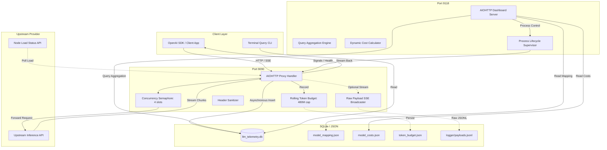

# Architecture & Design

The LLM Telemetry Proxy and Dashboard suite is designed around the principles of **passive interception**, **zero-latency overhead**, and **self-contained durability**.

---

## 🏛 System Architecture

The architecture decouples the high-throughput inference proxy path from the analytical reporting and dashboard server.

---

## 💾 Database Schema

The proxy maintains two primary SQLite tables in `data/llm_telemetry.db`:

### `api_calls` Table
Stores completed inference requests and metric breakdowns:

| Column | Type | Description |
| :--- | :--- | :--- |
| `id` | `INTEGER PRIMARY KEY` | Auto-incrementing identifier. |
| `timestamp` | `TEXT` | UTC ISO-8601 timestamp (`YYYY-MM-DDTHH:MM:SS.mmmmmm+00:00`). |
| `model` | `TEXT` | Canonicalized model name (resolved via `data/model_mapping.json`). |
| `endpoint` | `TEXT` | Invoked path (e.g., `/v1/chat/completions`, `/v1/embeddings`). |
| `input_tokens` | `INTEGER` | Prompt / input token count. |
| `output_tokens` | `INTEGER` | Generated completion token count. |
| `ttfb_ms` | `REAL` | Time-To-First-Byte in milliseconds (from request dispatch to first byte). |
| `total_ms` | `REAL` | Total Round-Trip Time in milliseconds from request start to EOF. |
| `tokens_per_s` | `REAL` | Calculated generation throughput: `output_tokens / (total_ms / 1000)`. |
| `server_running` | `REAL` | Upstream active concurrent request load at time of call. |
| `server_tok_s` | `REAL` | Upstream server-wide token generation rate at time of call. |
| `server_model` | `TEXT` | Upstream matched hardware model identifier. |
| `status_code` | `INTEGER` | HTTP response code returned by upstream. |
| `error` | `TEXT` | Error message or failure type (if failed). |
| `call_type` | `TEXT` | Classified type: `chat`, `embedding`, `rerank`, `props`, `other`. |
| `calls_count` | `INTEGER` | Multiplier used for historical 2-week rolled-up aggregation (default `1`). |

### `proxy_calls` Table
Tracks every single request hitting the gateway—including early timeouts, connection rejections, non-inference calls, and token budget blocks:

| Column | Type | Description |
| :--- | :--- | :--- |
| `id` | `INTEGER PRIMARY KEY` | Auto-incrementing identifier. |
| `timestamp` | `TEXT` | UTC ISO-8601 timestamp. |
| `endpoint` | `TEXT` | Target path. |
| `method` | `TEXT` | HTTP Verb (`GET`, `POST`, `OPTIONS`). |
| `call_type` | `TEXT` | Call classification. |
| `model` | `TEXT` | Model name if provided. |
| `status_code` | `INTEGER` | HTTP status code. |
| `error` | `TEXT` | Error reason if failed. |
| `logged` | `INTEGER` | `1` if also logged to `api_calls`, `0` if skipped/failed before logging. |
| `ttfb_ms` | `REAL` | Time to first byte. |
| `total_ms` | `REAL` | Total RTT. |
| `calls_count` | `INTEGER` | Aggregation multiplier for compressed buckets. |

---

## 🗜 Historical Compaction Strategy (`db_compress.py`)

To prevent database bloat over months of continuous production logging:

1. **Closed-Bucket Rollups**: Records older than 14 days are grouped into fixed 2-week fortnights aligned to `2026-01-05T00:00:00Z`.
2. **Lossless Dimension Preservation**: Aggregations maintain exact grouping across:
   - `model` (canonicalized)
   - `endpoint`
   - `call_type`
   - `status_code`
   - `error`
3. **Multiplied Metric Mathematics**:
   - `input_tokens` and `output_tokens` are summed.
   - `ttfb_ms`, `total_ms`, `tokens_per_s`, and `server_running` are weighted by `calls_count`.
   - `calls_count` is incremented to represent the aggregated batch size.
4. **Zero-Downtime Vacuum**: The compressor runs inside an ACID SQLite transaction with automatic `.db.bak` creation, rollback protection, and `VACUUM` space reclamation.
