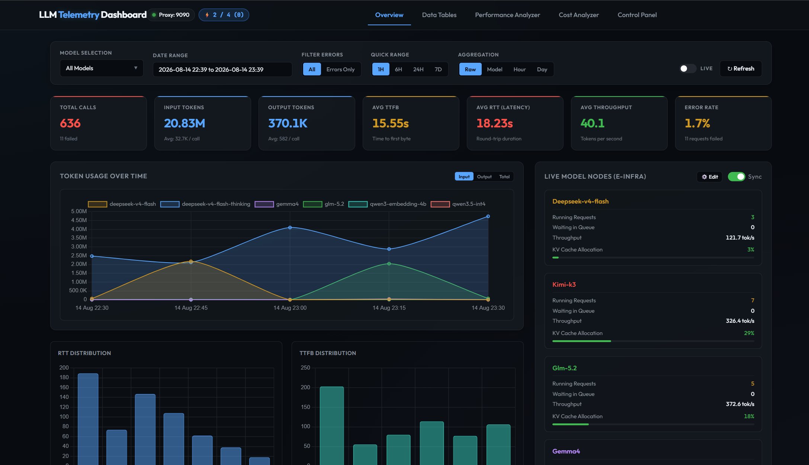
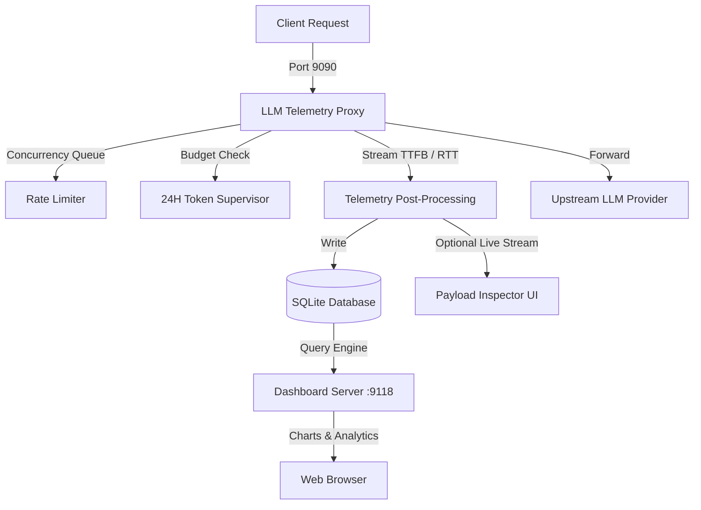

# LLM Telemetry Proxy & Dashboard

Welcome to the **LLM Telemetry Proxy & Observability Suite** documentation.

This suite provides a lightweight, non-intrusive reverse proxy and real-time visualization platform for Large Language Model (LLM) APIs.

  

---

## 🎯 What Problem Does This Solve?

When building LLM-powered applications or multi-agent workflows, engineering teams encounter several key challenges:

1. **Blind Spots in Token Economics**: Unpredictable token usage and lack of historical cost tracking across different models and price drops.
2. **Rate Limit 429 Cascades**: In-flight concurrency exceeding upstream provider limits during peak bursts.
3. **Latency & Throughput Variance**: Unclear breakdown between network TTFB (Time-To-First-Byte), model generation speed (tok/s), and total RTT.
4. **Debuggability Without Privacy Leaks**: Difficulty inspecting real-time prompts, tool calls, and reasoning tokens without exposing credentials or sending sensitive logs to third-party SaaS vendors.

**LLM Telemetry Proxy** solves all of these out of the box with zero external infrastructure dependencies.

---

## 🌟 Core Highlights

### 1. Transparent Reverse Proxying
- Fully compliant with OpenAI-compatible API routes (`/v1/chat/completions`, `/v1/embeddings`, `/v1/models`, `/v1/rerank`).
- Supports synchronous batch responses and Server-Sent Events (SSE) streaming.
- Passive metric capture without modifying or delaying request payloads.

### 2. Active Reliability & Rate Limiting
- **Adaptive Concurrency Semaphore**: Prevents upstream 429s by gating concurrent API calls.
- **Rolling 24-Hour Token Budget**: Hard quota enforcement with persistent state across process restarts.

### 3. Comprehensive Observability Dashboard
- **Performance Distributions**: Compare TTFB, Total RTT, and Generation Speed (tok/s) across models.
- **Model Duel & Head-to-Head Comparison**: Dynamic performance benchmarking between leading models.
- **Cost Analyzer**: Historical multi-tier cost modeling with automatic LiteLLM pricing synchronization.
- **Live Payload Inspector**: Real-time SSE streaming stream with structured prompt, reasoning, and tool call breakdown.

---

## 🧭 Navigation Guide

- **[Getting Started](getting-started.md)**: Prerequisites, setup, unified launcher, and client configuration.
- **[Architecture & Design](architecture.md)**: Deep dive into the proxy pipeline, SQLite schema, and aggregation engine.
- **[Proxy Gateway](proxy.md)**: Proxy flags, concurrency semaphore, token budget supervisor, and raw payload logging.
- **[Analytics Dashboard](dashboard.md)**: Dashboard features, time series charts, model duel, and cost analyzer.
- **[API Reference](api-reference.md)**: REST endpoints and SSE streaming protocols.
- **[Maintenance & Operations](maintenance.md)**: Database compaction, LiteLLM pricing sync, and process lifecycle control.
